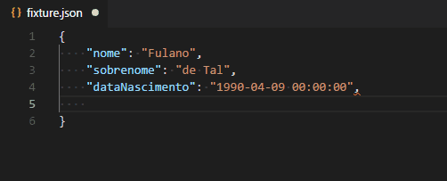
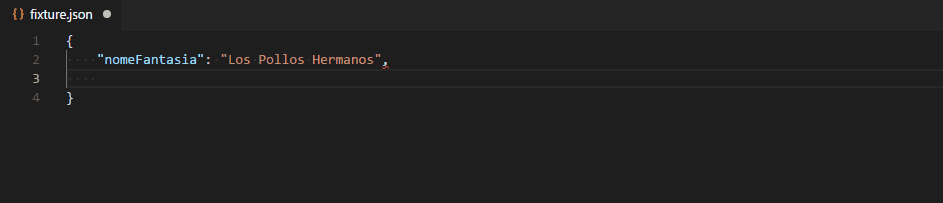

# Gerador de CPF/CNPJ

Esta extensão possibilita a inserção de CPF's e/ou CNPJ's gerados aleatoriamente, com ou sem máscara, diretamente no seu código.

## Utilização

Abra a paleta de comandos do VSCode através das teclas `Ctrl+Alt+P` e pesquise por **Gerar CPF** ou **Gerar CNPJ**, ou clique com o botão direito no arquivo que estiver editando e escolha a opção **Gerar CPF** ou **Gerar CNPJ**.

Em ambos os casos, o CPF ou CNPJ gerado será inserido na posição do cursor ou substituirá um trecho previamente selecionado.

## Configurações da extensão

Esta extensão disponibiliza as seguintes configurações:

* `geradorCpfCnpj.somenteNumeros`: habilita/desabilita a máscara nos CPF's e CNPJ's gerados
* `geradorCpfCnpj.habilitarMenuDeContexto`: habilita/desabilita opção de gerar CPF/CNPJ no menu de contexto

## Release Notes

### 1.1.1

Adicionado ícone.
Atualizando dependências para corrigir vulnerabilidades.

### 1.1.0

Adicionado menu de contexto.

### 1.0.0

Versão inicial.